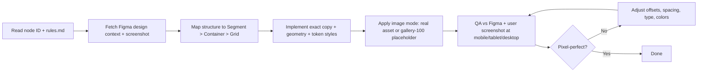

# Pixel-Perfect Figma Implementation Rules

## Purpose

This file is the implementation contract for converting Figma sections into this repo with 1:1 fidelity and minimal prompting.

Primary objective:
- one-shot section delivery using shared primitives and token-driven styling
- no reinterpretation of Figma
- no normalization of copy

---

## Gold Reference

Use [`src/components/modules/forge.tsx`](src/components/modules/forge.tsx) as the reference implementation pattern for:
- primitive-first composition (`Segment` + `Container` + `Grid`)
- fixed Figma geometry plus tokenized style values
- controlled micro-overrides where required for visual parity
- image-placeholder mode (when image import is intentionally skipped)

If a future section conflicts with this pattern, Figma wins. Document the reason in PR notes.

---

## Locked Decisions (Do Not Re-Ask)

- Breakpoints come from `src/app/tokens.css`.
  - mobile `< 720px`
  - tablet `720px - 1079px`
  - desktop `>= 1080px`
- Static state only.
- Strictly no deviation from Figma.
- Copy/content must be exact Figma copy.
- QA is mandatory against:
  - Figma snapshot
  - user-provided screenshot
- A section is complete only at pixel-perfect parity.
- Viewport-first sections must use viewport strategy, not arbitrary fixed height.
  - use `min-height: calc(100vh - navbar-height-from-figma)`
  - current navbar baseline is `76px` unless overridden by Figma node
- If user requests no image import:
  - keep target image container dimensions/position
  - fill that container with `gallery-100`
  - leave a commented `next/image` block at the image mount point

---

## Priority Order

1. Figma fidelity.
2. Token correctness (`src/app/tokens.css`).
3. Primitive-driven layout (`Segment`, `Container`, `Grid`).
4. Reusable architecture (`ui` first, then `modules` composition).
5. Accessibility and maintainability without visual drift.

If exact parity is blocked, stop and ask.

---

## One-Shot Input Contract (Minimal Prompting)

To one-shot a section, the prompt only needs:

1. Figma URL + node ID.
2. Any explicit constraints.
   - example: no image import
   - example: static only
3. Optional comparison screenshot.

Everything else must default to this file.

---

## One-Shot Workflow



---

## Primitive-First Layout Contract

### Mandatory usage

For split or column-based sections (including left-copy/right-visual):
- `Segment` is required for section rhythm wrapper.
- `Container` is required for page width and gutters.
- `Grid` is required for primary column spans.

These are not optional for split sections.

### When micro-layout can skip primitives

Only micro internals (badges, icon rows, small button clusters) may use local flex/grid without additional primitives.

---

## Canonical Section Skeleton

Use this shape first, then adapt values to node specs.

```tsx
import { Segment } from "@/components/primitives/segment/segment";
import { Container } from "@/components/primitives/container/container";
import { Grid } from "@/components/primitives/grid/grid";

export function SectionName() {
  return (
    <section data-section-id="FIGMA_SECTION_ID" className="bg-[var(--gallery-100)]">
      <Segment className="!py-0">
        <Container as="section" className="!px-10 pt-[120px] pb-10">
          <div className="flex items-start justify-between gap-6">
            <Grid mobile={12} tablet={12} desktop={5}>
              {/* left column */}
            </Grid>
            <Grid mobile={12} tablet={12} desktop={7} className="flex justify-end">
              {/* right column */}
            </Grid>
          </div>
        </Container>
      </Segment>
    </section>
  );
}
```

---

## Image Placeholder Mode (No Asset Import)

If image import is intentionally skipped:

```tsx
<div className="relative h-[854px] w-[854px] bg-(--gallery-100)">
  {/*
  <Image
    src={assetUrl}
    alt=""
    fill
    className="object-contain"
  />
  */}
</div>
```

Rules:
- never change container geometry when switching to placeholder mode
- keep same frame position and stacking
- keep annotation overlays/labels exactly where Figma places them

---

## Token Contract

- `src/app/tokens.css` is the source of truth.
- Do not hardcode values if a token exists.
- Add tokens before usage if missing.
- Keep naming conventions and responsive behavior consistent.

Required compatibility with primitive tokens:
- `--bp-min-mobile`, `--bp-min-tablet`, `--bp-min-desktop`
- `--page-width`, `--page-limit`
- `--container-gutter-mobile`, `--container-gutter-tablet`, `--container-gutter-desktop`
- `--segment-padding-mobile`, `--segment-padding`
- `--grid-column-count`

---

## Copy + Typography Contract

- Use exact text from Figma.
- Preserve line breaks and paragraph spacing from node.
- Preserve exact type values:
  - family
  - size
  - line-height
  - letter-spacing
  - weight

If text wraps differently, fix width/line-breaks first. Do not rewrite copy.

---

## Forge-Derived Lessons (Must Apply)

1. Start from layout primitives, not ad hoc wrappers.
2. Establish desktop geometry first, then map tablet/mobile via `Grid`.
3. Keep Figma frame paddings explicit on `Container`; do not approximate.
4. Allow tightly scoped local tweaks for true parity.
   - example: small negative margin/gutter offsets if needed
5. Keep section code readable by preserving a strict left-column/right-column split.
6. When image is omitted, preserve full visual box and annotate mount point with commented `Image`.
7. Keep section semantics stable with `as="section"` and `data-section-id`.

---

## QA Checklist (Required)

1. Node ID and copy verified against Figma.
2. Desktop/tablet/mobile checked against token breakpoints.
3. Spacing, sizes, and offsets match Figma.
4. Typography values match Figma.
5. Colors, borders, radii, shadows, opacity match Figma.
6. Layer order and clipping match Figma.
7. Placeholder mode handled correctly if image import skipped.
8. Pixel diff reviewed against:
   - Figma snapshot
   - user screenshot
9. Lint/type/build checks pass for touched files.

---

## Done Definition

A section is done only when:
- visual parity is 1:1 at required breakpoints
- primitives are used correctly for section structure
- token usage is correct
- copy is exact
- static-only behavior is preserved

---

## Master Prompt Template

Copy this as default prompt for future sections:

```md
Implement Figma node <NODE_ID> from <FIGMA_URL> with strict 1:1 static parity.
Follow rules.md as source of truth.
Use Segment + Container + Grid as primary layout primitives.
Use tokens.css for all style values.
Use exact Figma copy and line breaks.
QA against Figma screenshot and my provided screenshot.
If image import is skipped, use gallery-100 placeholder and keep commented next/image at mount point.
```
